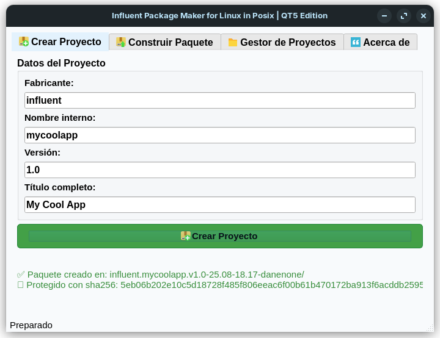
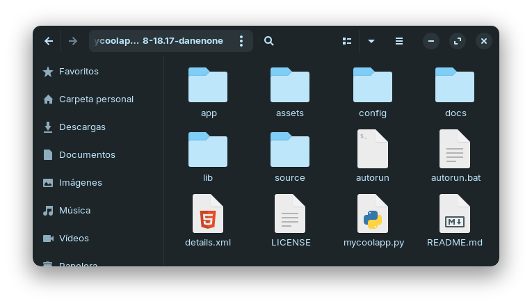
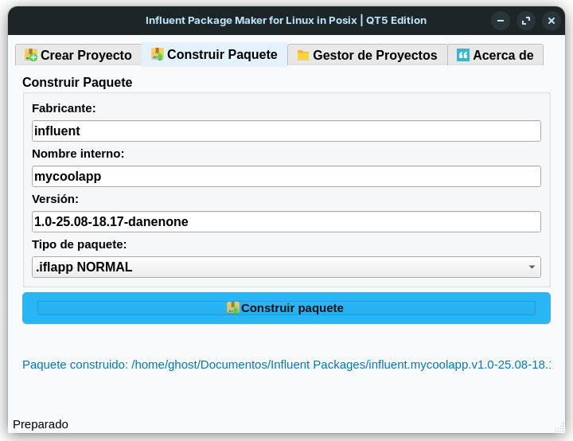
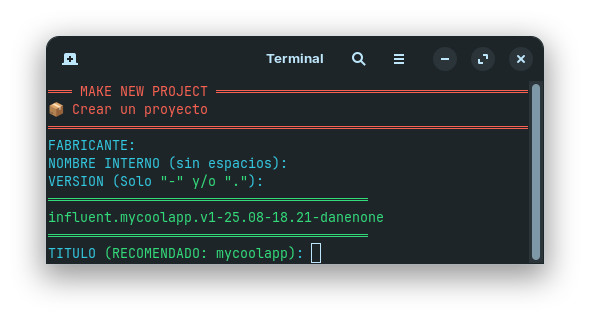
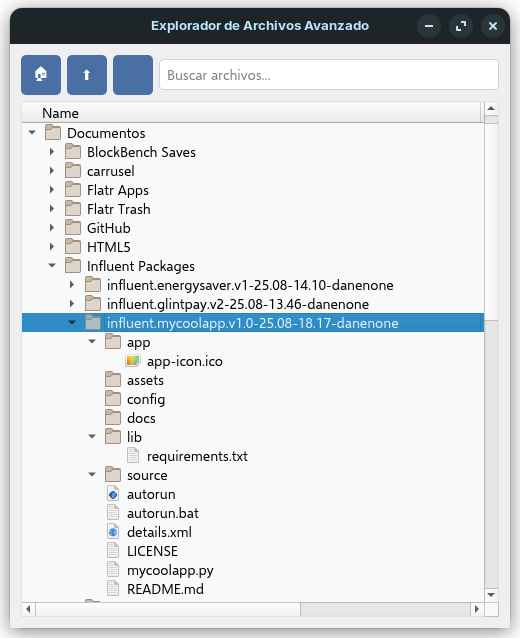
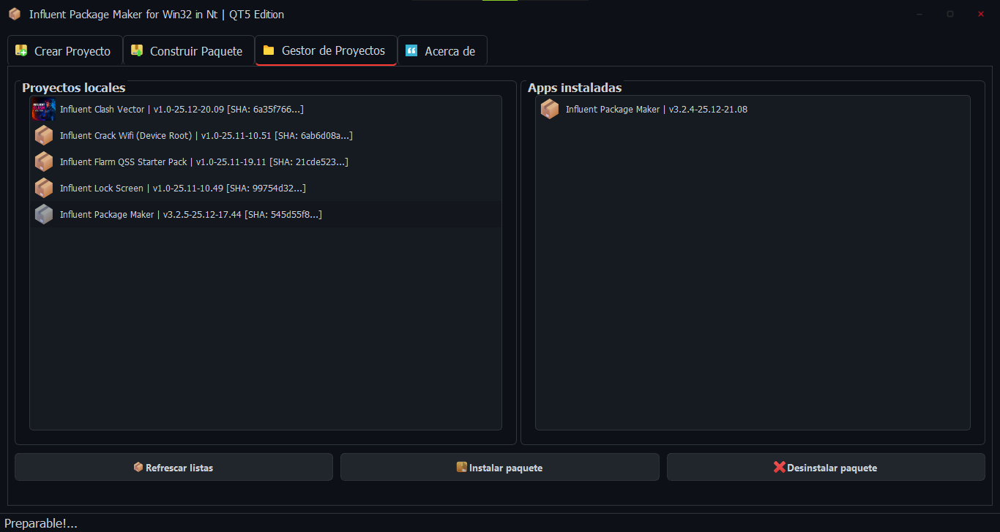
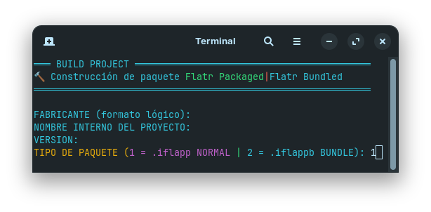
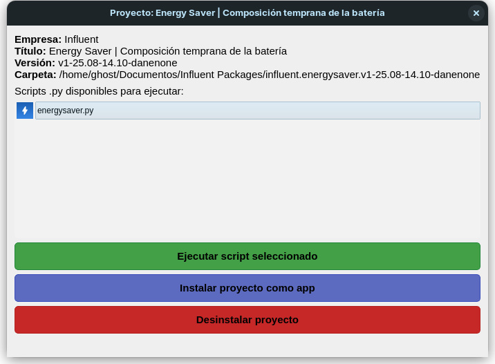
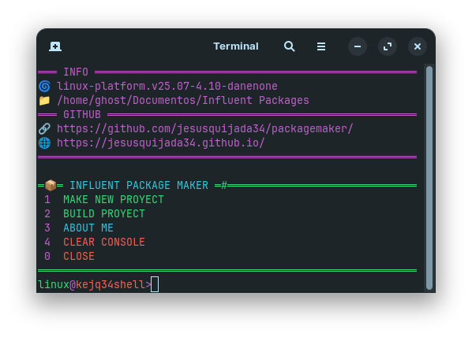

# 🧭 Influent Package Maker (IPM)
### Influent Package Maker (IPM) es un sistema modular de gestión y empaquetado de aplicaciones, diseñado por Jesús Quijada, con el propósito de simplificar y estandarizar el desarrollo de software distribuible, especialmente en entornos Linux como Zorin OS. Más allá de ser un simple empaquetador, IPM es una filosofía de organización creativa y técnica que refleja una preocupación por la estética, la compatibilidad multiplataforma y la autonomía del desarrollador.

## 📦 Influent Package Maker (IPM)

*"Herramienta todo-en-uno para crear, empaquetar y gestionar proyectos Influent (.iflapp, .iflappb)"*

<div align="center">
  
</div>

## 🚀 Características Principales
- **Interfaz dual**: GUI (PyQt5) + Terminal interactiva
- **Formatos soportados**:
  - `.iflapp` (paquete normal)
  - `.iflappb` (bundle, nuevamente en febrero de 2026 se harán paquetes xml con esta extensión estilo android. Por lo tanto son paquetes en común y corriente)
- **Gestión completa**: Crear, construir, instalar/desinstalar
- **Protección integrada**: Hash SHA256 automático
- **Multiplataforma**: Linux y Windows

## 🖼️ Capturas
| GUI | Terminal | Estructura |
|-----|----------|------------|
|  |  |  |
|  |  |  |
|  |  |
|  |  |
|  |

## 📦 Estructura de Paquetes
### La estructura de un paquete puede ser asi:
### empresa: Influent
### nombre corto: camera
### version: 1
### Y.M-h.m-danenone
> influent.camera.v1-25.08-16.17-danenone
### Carpetas y archivos generados:
`app/app-icon.ico`
`assets/.assets-container` `config/.config-container` `docs/.docs-container` `lib/.lib-container, requirements.txt` `source/.source-container` `autorun` `autorun.bat` (SH/Batch Generado por el programa en una carpeta de proyecto para instalar o descargar dependencias y proceder a el script para depurar) `details.xml` (Informador de la tienda Generado por el creador, Incluye firma sha256 (correlationid), version, nombre, empresa, en que SO se ha creado, titulo, version del Danenone (Router, o mejor dicho, Motor Core) y clasificado de edad, Ejemplo:)
```<app><publisher>influent</publisher><app>packagemaker</app><name>Package maker</name><version>v1-25.08-14.05-danenone</version><with>linux</with><danenone>25.08-14.06</danenone><correlationid>b8539a2301cc1d392ba692b914b6417decb240b9ae167c7a4fa392ad4faae68e</correlationid><rate>Todas las edades</rate></app>```

`LICENSE` (Licencia GNU/Github Generada por el creador, para otorgar leyes) `{nombre-corto}.py` (Python Generado por el creador, Plantilla para llenarla con el bloque correcto) `.storedetail` (Firma Sha256 Generada por el creador, para evitar clones y copias de el paquete. Ejemplo:)
```b8539a2301cc1d392ba692b914b6417decb240b9ae167c7a4fa392ad4faae68e```

# 🛠️ Origen del proyecto
### IPM fue creado como una solución personal para automatizar y estructurar el flujo de trabajo al desarrollar múltiples aplicaciones creativas — como Influent Camera — permitiendo:
> Documentar cada app automáticamente

> Generar paquetes .iflapp (Flatr App Package) y .iflappb (Flater App Bundle) para fácil distribución

> Acompañar cada entrega con su ícono, requerimientos y metadata descriptiva

> Evitar la dependencia de formatos externos como .deb, .rpm o AppImage

> Jesús observó la necesidad de algo más sencillo, visual y personalizable, que pudiera evolucionar hacia un ecosistema completo de herramientas Influent — cada una con su propia identidad y propósito.

---

# 🧠 Filosofía técnica
### IPM se construye sobre los siguientes principios:
> Legibilidad: El código está cuidadosamente organizado, con variables globales definidas al inicio y menús ANSI que mejoran la experiencia en terminal.

> Modularidad: Cada paquete se aloja en su propia carpeta, con estructura estándar (app, config, docs, assets, lib) para facilitar edición y navegación.

> Automatización inteligente:

> Generación automática de details.xml con metadatos únicos, hash SHA256, fecha y clasificación de edad por palabras clave.

> Generación interactiva o automática de README.md con estructura, requisitos, ejemplos y descripción.

> Compresión con barra de progreso visual usando tqdm.

---

# 👤 Sobre el creador
### Jesús Quijada es un desarrollador multidisciplinario apasionado por la convergencia entre estética visual y funcionalidad técnica. Con experiencia avanzada en Python, scripting multiplataforma, GUI moderna con CustomTkinter y distribución modular, su enfoque se distingue por:
> Temáticas limpias y vibrantes en el diseño de interfaces

> Iteración constante buscando perfección técnica y visual

> Autonomía creativa para construir herramientas que van más allá del estándar

> IPM es la manifestación tangible de esa mentalidad: una herramienta creada por y para desarrolladores que quieren controlar cada aspecto de su entrega.

---

# 🧰 Tecnologías utilizadas
> Python 3.10+

> tqdm para barra de progreso

> xml.etree.ElementTree para metadatos

> ANSI para interfaz en terminal

> Formato .iflapp y .iflappb como estándar personalizado

---

# 📦 ¿Qué vendrá después?
### IPM es solo el principio de un ecosistema donde cada app puede ser creada, empaquetada, documentada y distribuida con total estilo y control. Jesús planea integrar funciones a una nueva app, que lleva el nombre de "Influent Flatr Installer" (Se conecta con la tienda Flatr para metadatos), se hace desde cero como:
> Instalador automático de dependencias

> Detector de GUI y CLI para generar lanzadores .desktop para entornos linux

> Exportación directa a USB o Web con firma criptográfica

> Integración con Influent Dashboard para visualizar apps install

> Implementador a la Tienda Flatr

> Instalador de paquetes haciendo un "scanner" dentro del paquete para verificar validez y que cumpla con los TERMS and CONDITIONS

> Version multiplataforma para terminal interactiva con colores ANSI, "choices" y comandos integrados ("flatr-shell") para dispositivos no compatibles con PyQT

> Version multiplataforma para interfaz adictiva a entorno QT "flatr" para dispositivos alta gama con esta poderosa interfaz

> Integración con Gabo AI para búsqueda de paquetes fuera del cátalogo, búsqueda por voz similar a `Google PlayStore`, categorías para búsqueda poderosa de apps.
